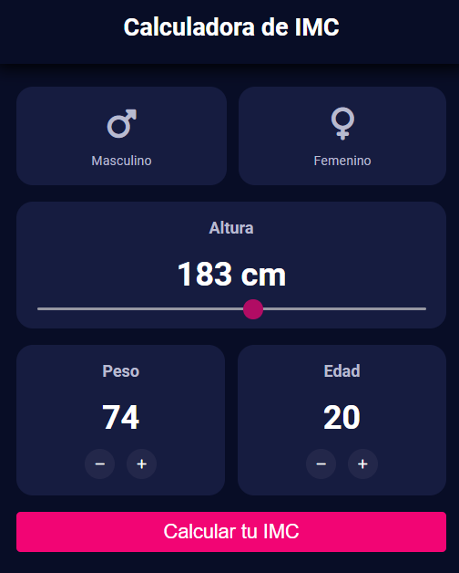
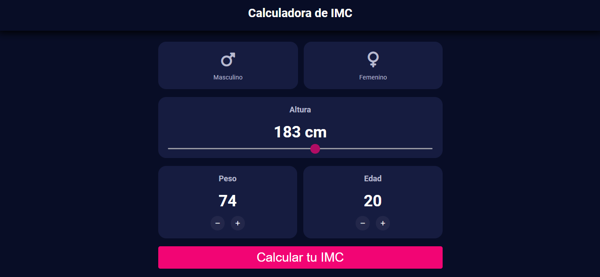

# Calculadora de IMC

## Descripción

La **Calculadora de IMC** es una aplicación diseñada para calcular el Índice de Masa Corporal (IMC) de los usuarios y proporcionarles una interpretación de los resultados. La aplicación permite a los usuarios ingresar datos como género, edad, peso y altura, y luego calcula su IMC para clasificarlo en diferentes categorías como desnutrición, normal, sobrepeso u obesidad.

### Características Principales

- **Cálculo del IMC**: Basado en los datos de peso y altura proporcionados por el usuario.
- **Interpretación del IMC**: Muestra una tabla con la clasificación del IMC y las categorías asociadas.
- **Interfaz de Usuario**: Diseñada para ser intuitiva y fácil de usar, con un diseño adaptable a dispositivos móviles y de escritorio.

## Tecnologías y Herramientas Utilizadas

- **HTML5**: Estructura y contenido de la página.
- **CSS3**: Estilización y diseño adaptativo.
- **JavaScript**: Lógica de cálculo y manejo de eventos.
- **Flexbox/Grid**: Diseño adaptable.
- **Dribbble**: Perfil del diseñador Rubén Vaalt.

### Créditos

- **Diseño**: Rubén Vaalt ([Perfil en Dribbble](https://dribbble.com/rvaalt))
- **Desarrollo**: Diego Meza

### 2. **Capturas de Pantalla**

Imágenes o capturas de pantalla de la aplicación en diferentes dispositivos para mostrar el diseño y la funcionalidad.

```markdown
## Capturas de Pantalla




```
